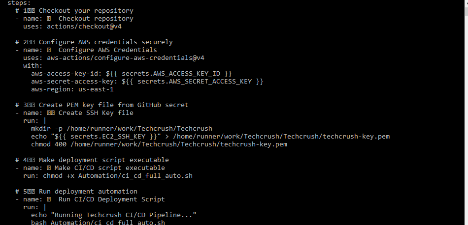
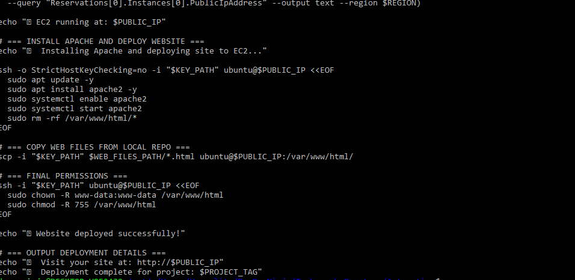

# Techcrush Static Website CI/CD Deployment 
📘 Project Overview

This project automates the deployment of a static website in AWS using a fully automated CI/CD pipeline.
The pipeline provisions cloud infrastructure, deploys web content, and ensures updates are continuously delivered without manual intervention at every git push instance.

# Key Technologies Used:

AWS EC2, VPC, Subnet, Security Groups

Bash scripting (Automation)

GitHub Actions (CI/CD Pipeline)

Ubuntu 22.04 Server

HTML5 / CSS3 (Responsive Web Design)

# 🚀 2. Deployment Workflow Overview
Step 1 — GitHub Actions Trigger

Every time a commit is pushed to the main branch, the deploy.yml workflow is triggered.
It initializes the CI/CD environment and runs the automation script.

Step 2 — Infrastructure Provisioning

The ci_cd_full_auto.sh script:

Creates a VPC, Subnet, Internet Gateway, and Route Table

Configures Security Groups (ports 22 and 80 open)

Launches a new Ubuntu 22.04 EC2 instance

Automatically fetches the Public IP

# Step 3 — Server Configuration & Deployment

Once the EC2 instance is running:

The script connects via SSH using a private key

Installs Apache Web Server

Uploads the index.html, aboutus.html, and contact.html files to /var/www/html/

The web application becomes instantly live.
[text](<../Automation Scripts>)

# Step 4 — Website Verification

After successful deployment, I access my live site via the EC2 public IP:

[http://<your-public-ip>](http://98.93.75.77/index.html)
[http://<your-public-ip>](http://98.93.75.77/aboutus.html
[http://<your-public-ip>](http://98.93.75.77/contact.html

