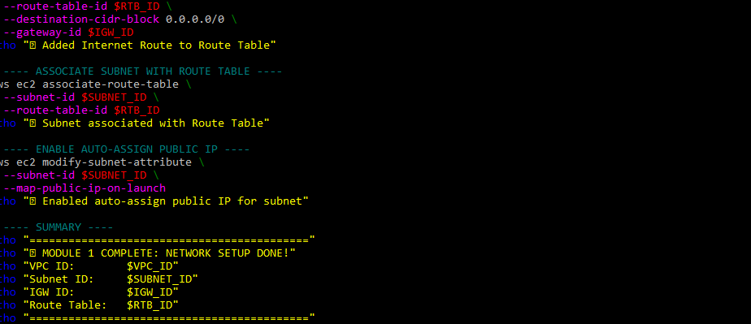
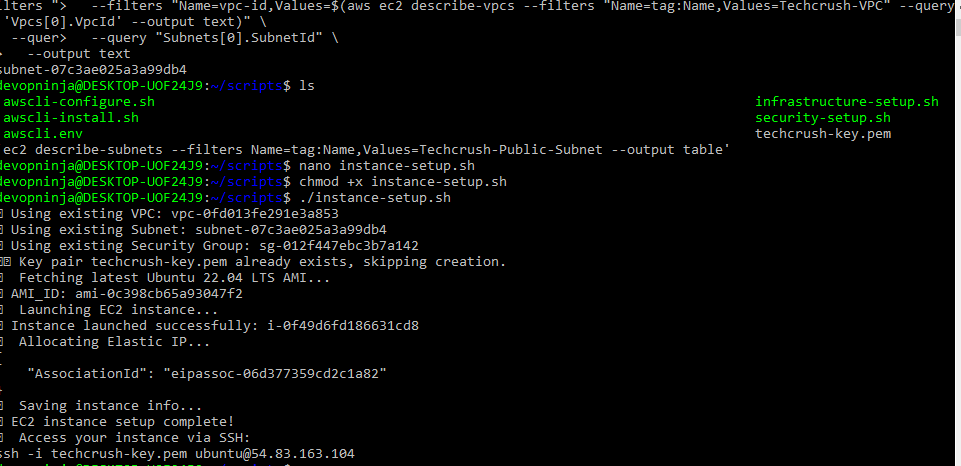
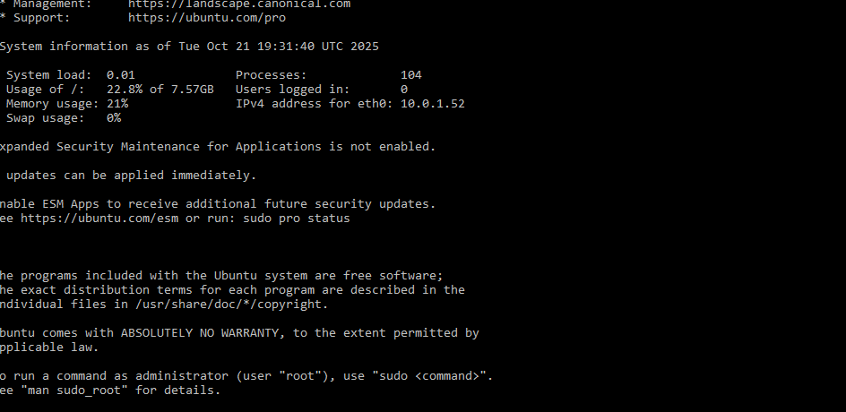

# STEP 1 — Network Infrastructure Setup

1. I use bash script that handles the following:

- Create a new VPC (10.0.0.0/16)

- Create public subnet (10.0.1.0/24)

- Attach Internet Gateway

- Create route table and associate it

2. I verified the resources created using aws ec2 describe commands to filter and list the resources in a table  

# STEP 2 — Security Configuration

1. I use bash script to Create and configure security groups to control inbound/outbound traffic for the Network Infrastructure created above.

2. I also verify the security group created and listed it in table using aws ec2 commands

 

# STEP 3 — EC2 Instance Deployment
1. I use bash scripts to handle the following:
-	Creates a new EC2 key pair for SSH login
-	Finds the latest Ubuntu 22.04 LTS AMI ID
-	Launches an EC2 instance in the Techcrush VPC/Subnet
-	Attaches it to Techcrush-Web-SG security group
-	Allocates and associates an Elastic IP
-	Saves instance and EIP details to instance_info.txt
  

2. I successfully login to the ec2 ubuntu server using ssh
  

# STEP 4 — Web Server Setup (NGINX + Static Website)

1. I use bash script to configure EC2 instance for the following:

-	Install and start NGINX
-	Deploy static website (HTML/CSS/JS)
-	Set up file permissions
-	Verify public access

2. I run the website created and it works fine, responsive and mobile friendly
[Index](index.html)3. 